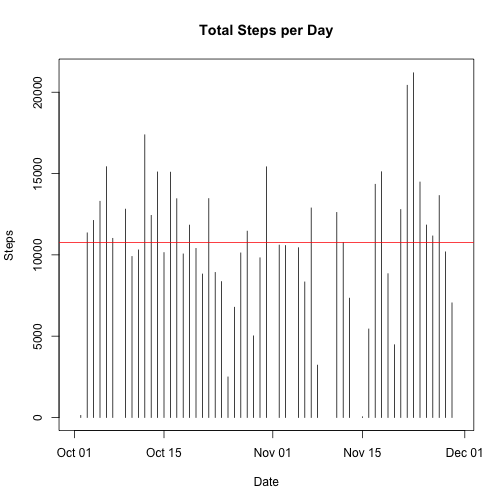
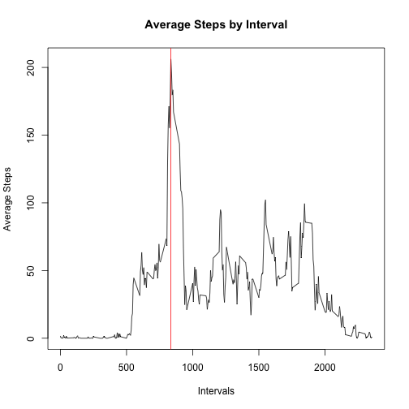
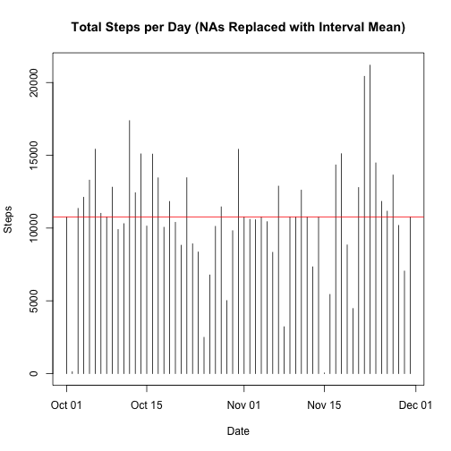

## Loading and preprocessing the data

```r
theData<-read.csv("activity.csv")
theData$date<-as.Date(as.character(theData$date))
```

## What is mean total number of steps taken per day?

```r
aggData<-aggregate(x=theData["steps"],by=list(Group.date = theData$date),FUN=sum,rm.NA=TRUE)
plot(aggData$Group.date,aggData$steps,type="h",main="Total Steps per Day",xlab="Date",ylab="Steps")
abline(h=mean(aggData$steps,na.rm=TRUE),col="red")
```

 

The steps per day mean is 10767.1887 and 
the median    10766.0.

## What is the average daily activity pattern?

```r
aggInterval<-aggregate(x=theData["steps"],by=list(Group.interval = theData$interval),FUN=mean,na.rm=TRUE)
plot(aggInterval$Group.interval,aggInterval$steps,type="l",main="Average Steps by Interval",xlab="Intervals",ylab="Average Steps")
abline(v=aggInterval$Group.interval[ which.max(aggInterval$steps) ],col="red")
```

 

Interval 835 has maximum average steps 
of   206.1698.


## Imputing missing values

```r
#
#  Merge in interval means from aggregate table (computed above), then replace interval NAs with interval means
#
dataWithMeans <- merge( theData, aggInterval, by.x = "interval", by.y ="Group.interval" )
dataWithMeans$steps.x <- ifelse( is.na( dataWithMeans$steps.x ), dataWithMeans$steps.y, dataWithMeans$steps.x )
dataWithMeans <- dataWithMeans[order(dataWithMeans$date,dataWithMeans$interval),]

dataWithMeans <- subset(dataWithMeans, select = -c(steps.y) )
colnames(dataWithMeans) <- c("interval", "steps","date")

aggData<-aggregate(x=dataWithMeans["steps"],by=list(Group.date = dataWithMeans$date),FUN=sum,rm.NA=TRUE)
plot(aggData$Group.date,aggData$steps,type="h",main="Total Steps per Day (NAs Replaced with Interval Mean)",xlab="Date",ylab="Steps")
abline(h=mean(aggData$steps,na.rm=TRUE),col="red")
```

 

The steps per day mean is 10767.1887 and 
the median    10767.2.

The effect of replacing NAs is insignificant in terms of the mean, but notice the slight increase in the median value.  The histogram does show changes in total number of steps, a result of the replacements.

## Are there differences in activity patterns between weekdays and weekends?

```r
library(lattice)
#
#  Create weekend/weekday factor and add to means dataframe
#
dayOfWeek<-weekdays(dataWithMeans$date)
lDayOfWeek<-dayOfWeek == "Sunday" | dayOfWeek == "Saturday"
dataWithMeans$weekend<-factor(lDayOfWeek,levels=c(TRUE,FALSE),labels=c("weekend","weekday"))
#
#  Aggregate over weekend factor and intervals and plot
#
aggData<-aggregate(x=dataWithMeans["steps"],by=list(weekend=dataWithMeans$weekend,interval=dataWithMeans$interval),FUN=mean)
xyplot(steps ~ interval | weekend,data = aggData,type = "l",xlab = "Interval",ylab = "Number of steps",layout=c(1,2))
```

 

The weekend pattern is shifted later in the day, and has activity spread more uniformly over the day.  In particular, the early morning spike in activity exhibited on weekdays is not as marked on weekends.
